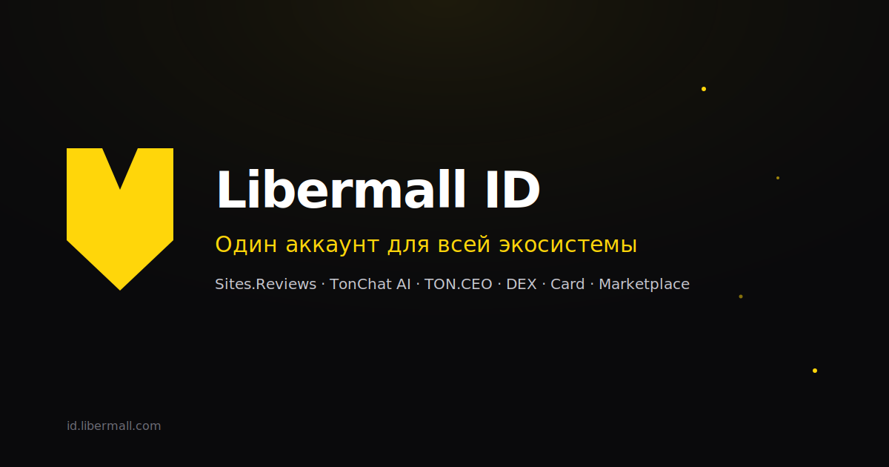

<div align="center">

# Libermall ID

**One identity for the entire Libermall ecosystem.**
*Single sign-on for Web3 — Telegram, TON Connect, Apple, Google or email magic link.*

[](LICENSE)
[](https://id.libermall.com)
[](https://t.me/LibermallIDbot)
[](https://casdoor.org/)
[](https://openid.net/connect/)
[](https://oauth.net/2/)
[](https://en.wikipedia.org/wiki/SAML_2.0)
[](https://docs.ton.org/develop/dapps/ton-connect/overview)



[**Live demo**](https://id.libermall.com) · [**Quickstart**](https://id.libermall.com/docs-quickstart.html) · [**API playground**](https://id.libermall.com/api-playground.html) · [**Brand kit**](BRANDBOOK.md) · [**Docs**](docs/)

</div>

---

## What is this?

`libermall-id-landing` is the **marketing website + brand book + design system** for [`id.libermall.com`](https://id.libermall.com) — the open identity layer that powers every product in the Libermall ecosystem.

The auth server itself is [Casdoor](https://casdoor.org/) (self-hosted, BSD-3). This repo is *just* the public-facing site: hero, docs, quickstart, dashboards, legal — all static HTML so any CDN can serve it. There is **no build step**.

```
You sign in once → every Libermall product knows who you are.
```

## Who already runs on Libermall ID

| Product | URL | What it is |
|---|---|---|
| 🛒 **Libermall Marketplace** | [libermall.com](https://libermall.com) | NFT + commerce marketplace on TON |
| 🔁 **Libermall DEX** | [dex.libermall.com](https://dex.libermall.com) | Decentralized exchange on the TON blockchain |
| 💳 **PayLibermall** | [pay.libermall.com](https://pay.libermall.com) | Payment system & merchant gateway for the ecosystem |
| 💳 **Libermall Card** | [card.libermall.com](https://card.libermall.com) | Virtual cards funded by crypto |
| ⭐ **Sites.Reviews** | [sites.reviews](https://sites.reviews) | Reputation & scam-check platform |
| 🤖 **TonChat AI** | [tonchat.ai](https://tonchat.ai) | AI assistant for TON & crypto |
| 🌐 **TON.CEO** | [ton.ceo](https://ton.ceo) | Mastodon-style social network for TON |

We're building this at Amazon-scale ecosystem density — one identity, every surface.

## Why Libermall ID

|  | Libermall ID | Auth0 / Okta | Clerk | Self-built |
|---|:---:|:---:|:---:|:---:|
| Free for end-users | ✅ forever | ✅ | ✅ | n/a |
| Free dev tier | ✅ 10K MAU | 7K MAU | 10K MAU | n/a |
| **Telegram Login built-in** | ✅ | ❌ | ❌ | weeks |
| **TON Connect (Ed25519) built-in** | ✅ | ❌ | ❌ | weeks |
| OpenID Connect 1.0 | ✅ | ✅ | ✅ | weeks |
| OAuth 2.0 + PKCE | ✅ | ✅ | ✅ | weeks |
| SAML 2.0 | ✅ | ✅ | partial | months |
| Self-hosted option | ✅ | enterprise | ❌ | n/a |
| Cross-product profile | ✅ 7+ apps | ❌ | ❌ | n/a |
| Open source | ✅ MIT | ❌ | ❌ | ✅ |

Auth0 charges $240/mo at 10K MAU. We're $0 — and we're built **with** Web3, not retrofitted to it.

## Quickstart — integrate in 5 minutes

```js
import { Issuer } from 'openid-client';

const issuer = await Issuer.discover('https://id.libermall.com');

const client = new issuer.Client({
  client_id: process.env.LIBERMALL_CLIENT_ID,
  client_secret: process.env.LIBERMALL_CLIENT_SECRET,
  redirect_uris: ['https://yourapp.com/oauth/libermall/callback'],
  response_types: ['code'],
});

// Redirect users to:
const authUrl = client.authorizationUrl({
  scope: 'openid profile email wallets',
  state: 'random-csrf-token',
});

// After callback, exchange code for tokens:
const params = client.callbackParams(req);
const tokenSet = await client.callback(client.redirect_uris[0], params, { state });

// id_token contains: { sub, name, email, telegram_id, ton_wallets[] }
const userInfo = await client.userinfo(tokenSet.access_token);
```

Want copy-paste examples for Laravel, Next.js, Python, or curl? See [`docs/integration.md`](docs/integration.md) or open the [**interactive API playground**](https://id.libermall.com/api-playground.html).

## OIDC endpoints

```
Discovery       https://id.libermall.com/.well-known/openid-configuration
Authorization   https://id.libermall.com/login/oauth/authorize
Token           https://id.libermall.com/api/login/oauth/access_token
Userinfo        https://id.libermall.com/api/userinfo
JWKS            https://id.libermall.com/.well-known/jwks
End session     https://id.libermall.com/api/logout
```

JWT signing: **RS256, 4096-bit key**. JWKS rotation every 90 days.

## Sign-in methods supported

| Method | Latency | Fields | Backed by |
|---|---|---|---|
| **Telegram Login Widget** | ~3 sec | 0 | HMAC-SHA256 |
| **TON Connect** | ~5 sec | 0 | Ed25519 proof |
| **Email magic link** | ~15 sec | 1 (email) | One-time token |
| **Apple ID** | ~3 sec | 0 | Sign in with Apple |
| **Google** | ~3 sec | 0 | OAuth 2.0 |

Every method resolves to the **same** profile. Link multiple — each becomes a backup.

## Architecture

```
                ┌─────────────────────────────────────────────────┐
                │              Your application                    │
                │   (Laravel / Next.js / Node / Python / curl)     │
                └─────────────────────────┬───────────────────────┘
                                          │  OAuth 2.0 / OIDC
                                          ▼
   ┌──────────────────────────────────────────────────────────────────────┐
   │                       id.libermall.com  (this repo)                   │
   │   Static landing  +  branded Casdoor /login  +  Telegram Mini App    │
   └─┬─────────────────────────────┬──────────────────────────────────┬──┘
     │ Telegram OAuth               │ TON Connect bridge               │ Email / SAML / Google / Apple
     ▼                              ▼                                  ▼
  @LibermallIDbot              Tonkeeper / MyTonWallet            SMTP / Apple / Google
```

See [`docs/architecture.md`](docs/architecture.md) for the full picture (provider plug-ins, JWT lifecycle, user provisioning, multi-tenant config).

## Repository layout

```
libermall-id-landing/
├── README.md              ← you are here
├── BRANDBOOK.md           ← colour, typography, logo, components
├── LICENSE                ← MIT
├── CONTRIBUTING.md        ← how to propose a change
├── SECURITY.md            ← report a vulnerability
├── CODE_OF_CONDUCT.md     ← Contributor Covenant v2.1
├── public/                ← the static site
│   ├── index.html         ← marketing home
│   ├── products.html      ← ecosystem catalog
│   ├── developers.html    ← OIDC docs + SDK
│   ├── docs-quickstart.html
│   ├── api-playground.html
│   ├── integrate.html     ← embed the button
│   ├── pricing.html
│   ├── compare.html       ← vs Auth0 / Clerk / Stytch / Keycloak
│   ├── use-cases.html
│   ├── customers.html     ← real production integrations
│   ├── security.html
│   ├── status.html        ← live system status
│   ├── changelog.html
│   ├── blog.html
│   ├── about.html
│   ├── login.html         ← branded auth shell (proxies Casdoor)
│   ├── signup.html
│   ├── signup-username.html
│   ├── signup-profile.html
│   ├── confirm.html       ← 6-digit code from @LibermallIDbot
│   ├── dashboard.html     ← user profile, sessions, linked accounts
│   ├── 404.html           ← branded error page
│   ├── privacy.html
│   ├── terms.html
│   ├── legal-dpa.html     ← Data Processing Agreement
│   ├── legal-sla.html     ← Service Level Agreement
│   ├── sitemap.xml
│   ├── robots.txt
│   ├── favicon.svg
│   └── assets/
│       ├── logo.svg
│       ├── og-cover.svg
│       └── style.css
├── docs/                  ← extended documentation
│   ├── architecture.md
│   ├── integration.md
│   ├── security.md
│   └── api-reference.md
├── img/                   ← screenshots, diagrams, social previews
├── deploy/                ← nginx config snippets
└── scripts/
    └── i18n_ru_to_en.py   ← translation tool used during rebrand
```

## Deploying

The site is dependency-free — any static host works (Cloudflare Pages, Vercel, Netlify, Nginx, S3+CloudFront).

We currently rsync onto the same VPS that runs Casdoor:

```bash
rsync -avz --delete public/ root@89.127.218.87:/var/www/libermall-id-landing/
```

Nginx routes everything **except** `/login`, `/signup`, `/callback`, `/api/*`, `/.well-known/*` to the static files; those proxy to Casdoor on `127.0.0.1:8000`. See [`deploy/`](deploy/) for the full nginx config.

## Standards

- **OpenID Connect 1.0** — discovery, JWKS, userinfo, dynamic registration
- **OAuth 2.0** — authorization code + PKCE, refresh tokens, device flow
- **OAuth 2.1** — draft compliant
- **SAML 2.0** — enterprise SSO
- **WebAuthn / FIDO2** — passkeys, hardware keys
- **TOTP** (RFC 6238) — 2FA codes
- **JWT** (RFC 7519) — RS256, 4096-bit

## Roadmap

- [x] Casdoor self-hosted on dedicated VPS
- [x] Telegram Login provider with HMAC verification
- [x] OAuth client #1: [sites.reviews](https://sites.reviews)
- [x] Branded landing site (25 pages, full English)
- [x] @LibermallIDbot + Telegram Mini App
- [x] SEO sweep (OG / Twitter / JSON-LD / robots / sitemap)
- [ ] **JS / TS SDK on npm** — `@libermall/id` with React hooks
- [ ] **GitHub Marketplace listing** — one-click install for any repo
- [ ] TON Connect IdP — custom Ed25519 bridge
- [ ] OAuth clients for [tonchat.ai](https://tonchat.ai), [ton.ceo](https://ton.ceo), [dex.libermall.com](https://dex.libermall.com), [pay.libermall.com](https://pay.libermall.com), [card.libermall.com](https://card.libermall.com)
- [ ] NFT-bound usernames (`@handle.lbm` minted via Tact contract on TON)
- [ ] $MALL utility token + cross-product reputation
- [ ] **Libermall Passport** — Telegram-Passport-style KYC vault
- [ ] **Libermall Mail** — Proton-style encrypted email on TON Storage

## Contributing

Issues and PRs welcome. Read [`CONTRIBUTING.md`](CONTRIBUTING.md) first.

If you want to report a security issue, please **don't** open a public issue — see [`SECURITY.md`](SECURITY.md) for the disclosure channel.

## License

[MIT](LICENSE) © 2026 Libermall — except `public/assets/logo.svg`, `public/favicon.svg`, and the **Libermall** wordmark, which are trademarks of Libermall and used under brand guidelines (see [`BRANDBOOK.md`](BRANDBOOK.md)).

---

<div align="center">

**Made with ⚡ by the [Libermall](https://libermall.com) team.**

[Website](https://id.libermall.com) · [Bot](https://t.me/LibermallIDbot) · [X](https://twitter.com/libermallnft) · [GitHub org](https://github.com/LiberMall)

</div>
